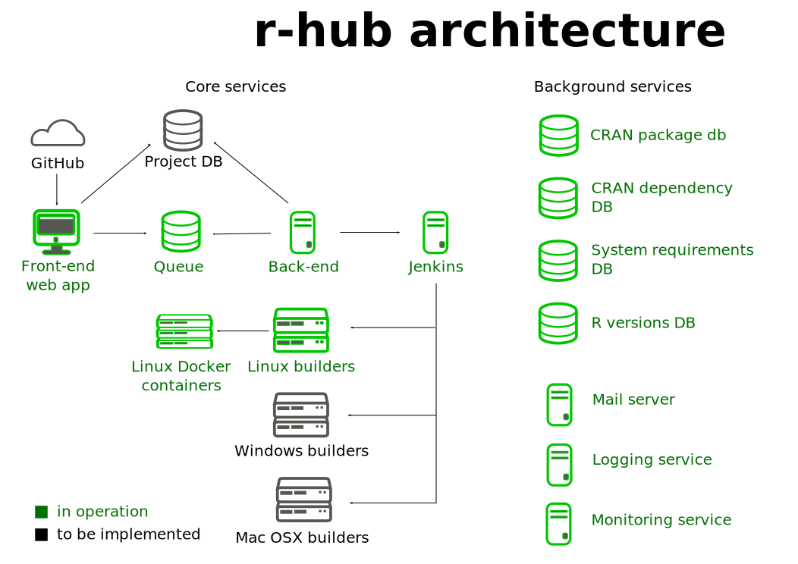

## { .nonum }

<style type="text/css">
@import url("https://maxcdn.bootstrapcdn.com/font-awesome/4.6.3/css/font-awesome.min.css");
@import url("https://cdn.rawgit.com/gaborcsardi/r-font/master/rlogo.css");
</style>

<h2 style="font-size:400%; margin-top:-80px;">The<br>r-hub<br>project</h2>

<h2 style="padding-top:6.5%;">Gábor Csárdi</h2>

<p style="line-height: 1">
csardi.gabor@<span></span>gmail.com
</p>


## Outline { .nonum }

```{r setup, echo = FALSE}
options(width = 55)
```

### 1. Package build & check service
### 2. System requirements
### 3. Package dependencies
### 4. The r-hub CI
### 5. Architecture
### 6. Coming soon
### 7. Questions


## Package build & check service

<span class="fa fa-gift fa-fw" aria-hidden="true"></span>&nbsp;&nbsp;
`R CMD build [package]`

<span class="fa fa-upload fa-fw" aria-hidden="true"></span>&nbsp;&nbsp;
Upload at https://builder.r-hub.io

<span class="fa fa-cog fa-spin fa-fw" aria-hidden="true"></span>&nbsp;&nbsp;
Check

<span class="fa fa-envelope fa-fw" aria-hidden="true"></span>&nbsp;&nbsp;
Receive results

## System requirements

`DESCRIPTION`

```
Package: curl
Type: Package
Title: A Modern and Flexible Web Client for R
Version: 0.9.7
Authors@R:
    c(person("Jeroen", "Ooms", , "jeroen.ooms@stat.ucla.edu",
             role = c("cre", "aut")))
	...
Description: The curl() and curl_download() functions provide highly
    ...
SystemRequirements: libcurl: libcurl-devel (rpm) or
        libcurl4-openssl-dev (deb).
...
```

## Sysreqs database

https://github.com/r-hub/sysreqsdb

```json
{
  "libcurl": {
    "sysreqs": "libcurl",
    "platforms": {
      "DEB": "libcurl4-openssl-dev",
      "OSX/brew": null,
      "RPM": "libcurl-devel"
    }
  }
}
```

## Package dependencies

`Remotes` in `DESCRIPTION`, see vignette in `devtools`

```
Package: mason
Title: Friendly Craftsman Who Builds Slick R Packages
Version: 1.0.0
...
Imports:
    ask,
    crayon,
    desc,
    praise
Remotes: gaborcsardi/readline,
    gaborcsardi/ask
```

## The r-hub CI

<span class="fa fa-github fa-fw" aria-hidden="true"></span>&nbsp;&nbsp;
Create hook on GitHub repository

<span class="fa fa-hand-o-up fa-fw" aria-hidden="true"></span>&nbsp;&nbsp;
Push commits to GitHub

<span class="icon-rlogo-alt" aria-hidden="true"></span>&nbsp;&nbsp;
GitHub triggers an r-hub build & check

<span class="fa fa-envelope fa-fw" aria-hidden="true"></span>&nbsp;&nbsp;
Receive notifications in email

## r-hub CI vs Travis CI

<div class="double">
<p class="double-flow">
  <span class="icon-rlogo-alt" aria-hidden="true"></span>&nbsp;&nbsp;
  R specific

  <span class="fa fa-check fa-fw" aria-hidden="true"></span>&nbsp;&nbsp;
  No configuration

  <span class="fa fa-windows fa-fw" aria-hidden="true"></span>
  <span class="fa fa-linux fa-fw" aria-hidden="true"></span>
  <span class="fa fa-apple fa-fw" aria-hidden="true"></span>&nbsp;&nbsp;
  Multiple platforms*

  <span class="fa fa-spinner fa-spin fa-fw" aria-hidden="true"></span>&nbsp;&nbsp;
  In the making

</p><p class="double-flow">

  <span class="fa fa-desktop fa-fw" aria-hidden="true"></span>&nbsp;&nbsp;
  General purpose

  <span class="fa fa-file-text-o fa-fw" aria-hidden="true"></span>&nbsp;&nbsp;
  Configuration needed

  <span class="fa fa-linux fa-fw" aria-hidden="true"></span>
  <span class="fa fa-apple fa-fw" aria-hidden="true"></span>&nbsp;&nbsp;
  Platforms: Ubuntu & OS X

  <span class="fa fa-thumbs-o-up fa-fw" aria-hidden="true"></span>&nbsp;&nbsp;
  Mature and feature-rich

</p>
</div>

# Architecture

## { }



## Coming soon(ish)

<div class="double">
<p class="double-flow">

  <span class="fa fa-windows fa-fw" aria-hidden="true"></span>&nbsp;&nbsp;
  Windows builds

  <span class="fa fa-user fa-fw" aria-hidden="true"></span>&nbsp;&nbsp;
  UI improvements

  <span class="fa fa-windows fa-fw" aria-hidden="true"></span>
  <span class="fa fa-linux fa-fw" aria-hidden="true"></span>
  <span class="fa fa-apple fa-fw" aria-hidden="true"></span>&nbsp;&nbsp;
  Multi-OS builds

  <span class="fa fa-database fa-fw" aria-hidden="true"></span>&nbsp;&nbsp;
  Caching of binaries

</p><p class="double-flow">

  <span class="fa fa-gift fa-fw" aria-hidden="true"></span>&nbsp;&nbsp;
  Package distribution

  <span class="fa fa-globe fa-fw" aria-hidden="true"></span>&nbsp;&nbsp;
  Web site

  <span class="fa fa-search fa-fw" aria-hidden="true"></span>&nbsp;&nbsp;
  Package search

  <span class="fa fa-terminal fa-fw" aria-hidden="true"></span>&nbsp;&nbsp;
  API, R package client

</p>
</div>

# `builder.r-hub.io` { style="font-size: 65%" } 

# `github.com/` { style="font-size: 65%" } <br> `r-hub/feedback` { style="font-size: 65%" }

# Questions

# Demo
