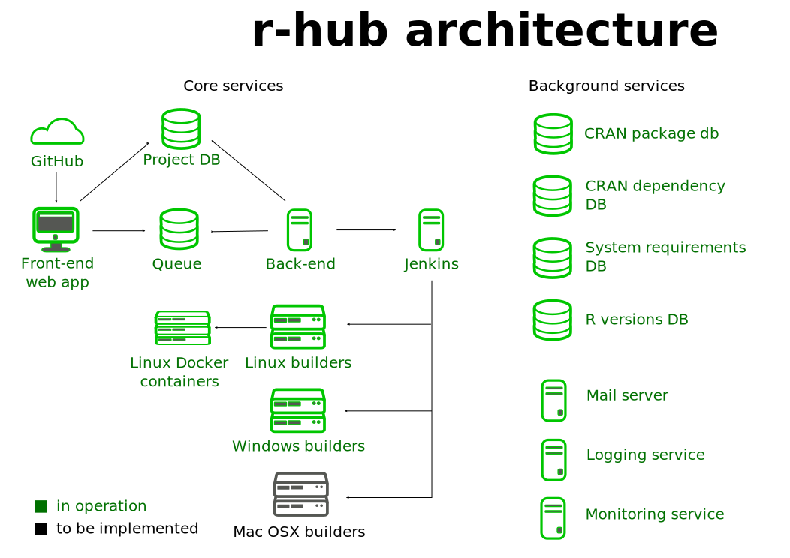

## { .nonum }

<style type="text/css">
@import url("https://maxcdn.bootstrapcdn.com/font-awesome/4.6.3/css/font-awesome.min.css");
@import url("https://cdn.rawgit.com/gaborcsardi/r-font/master/rlogo.css");
</style>

<h2 style="font-size:400%; margin-top:-80px;">The r-hub project</h2>


<h2 style="padding-top:16.5%;">Gábor Csárdi</h2>

<p style="line-height: 1">
csardi.gabor@<span></span>gmail.com
</p>

## r-hub: Package build & check service

<span class="fa fa-gift fa-fw" aria-hidden="true"></span>&nbsp;&nbsp;
`R CMD build [package]`

<span class="fa fa-upload fa-fw" aria-hidden="true"></span>&nbsp;&nbsp;
Upload at https://builder.r-hub.io, or from R

<span class="fa fa-windows fa-fw" aria-hidden="true"></span>
<span class="fa fa-linux fa-fw" aria-hidden="true"></span>
<span class="fa fa-apple fa-fw" aria-hidden="true"></span>&nbsp;&nbsp;
Select platform, R version, compiler, etc.

<span class="fa fa-cog fa-spin fa-fw" aria-hidden="true"></span>&nbsp;&nbsp;
Check

<span class="fa fa-envelope fa-fw" aria-hidden="true"></span>&nbsp;&nbsp;
Receive results

# Architecture

## { }



## System requirements

`DESCRIPTION`

```
Package: curl
Type: Package
Title: A Modern and Flexible Web Client for R
Version: 0.9.7
Authors@R:
    c(person("Jeroen", "Ooms", , "jeroen.ooms@stat.ucla.edu",
             role = c("cre", "aut")))
	...
Description: The curl() and curl_download() functions provide highly
    ...
SystemRequirements: libcurl: libcurl-devel (rpm) or
        libcurl4-openssl-dev (deb).
...
```

## Sysreqs database

https://github.com/r-hub/sysreqsdb

```json
{
  "libcurl": {
    "sysreqs": "libcurl",
    "platforms": {
      "DEB": "libcurl4-openssl-dev",
      "OSX/brew": null,
      "RPM": "libcurl-devel"
    }
  }
}
```

## Package dependencies

`Remotes` in `DESCRIPTION`, see vignette in `devtools`

```
Package: mason
Title: Friendly Craftsman Who Builds Slick R Packages
Version: 1.0.0
...
Imports:
    ask,
    crayon,
    desc,
    praise
Remotes: gaborcsardi/readline,
    gaborcsardi/ask
```

## { .cover }


## { .cover }


# `http://r-hub.io` { style="font-size: 65%" } 
