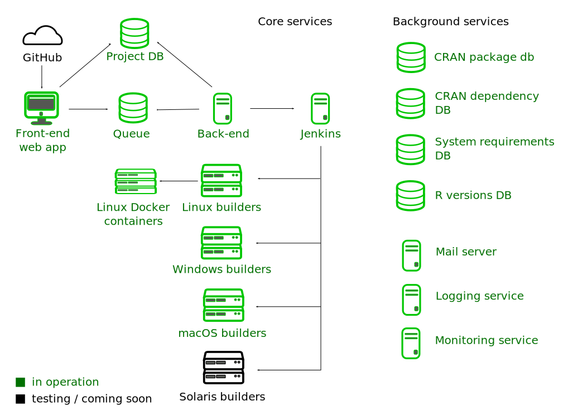
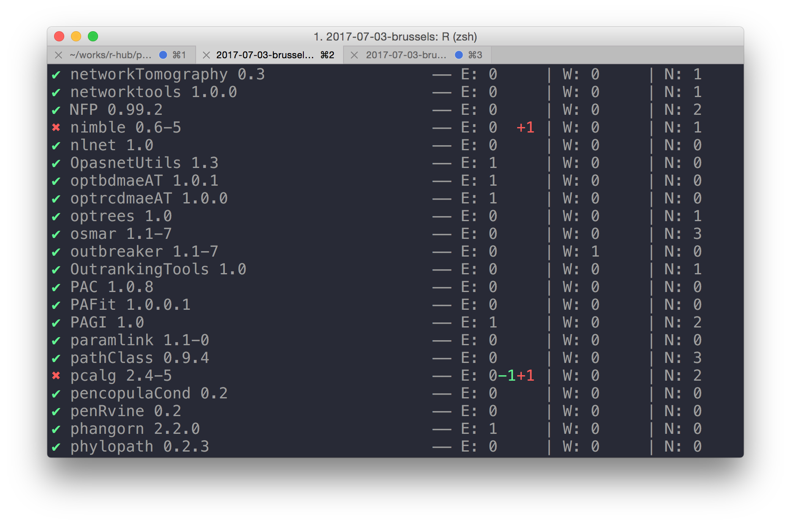

---
title: "R-hub"
author: "Gábor Csárdi"
email: "csardi.gabor@gmail.com"
output:
  rmdshower::shower_presentation:
    self_contained: false
    theme: ribbon
    keep_md: true
    css: style.css
    ratio: 16x10
---	

## { .nonum }

<style type="text/css">
@import url("https://maxcdn.bootstrapcdn.com/font-awesome/4.6.3/css/font-awesome.min.css");
@import url("https://cdn.rawgit.com/gaborcsardi/r-font/master/rlogo.css");
</style>

<h2 style="font-size:400%; margin-top:-80px;">R-hub</h2>

<h2 style="padding-top:26.5%;">Gábor Csárdi</h2>

<p style="line-height: 1">
csardi.gabor@<span></span>gmail.com
</p>


## Outline { .nonum }

```{r setup, echo = FALSE}
options(width = 55)
```

1. `R CMD check` as a service
     * Architecture
     * Demo
2. R packages
     * `processx`
     * `revdepcheck`

# <code>R&nbsp;CMD&nbsp;check</code> as a service

## Package build & check service

<span class="fa fa-check fa-fw" aria-hidden="true"></span>&nbsp;&nbsp;
Web submission

<span class="fa fa-check fa-fw" aria-hidden="true"></span>&nbsp;&nbsp;
API, R package client

<span class="fa fa-cog fa-spin fa-fw" aria-hidden="true"></span>&nbsp;&nbsp;
CI via GitHub (in progress)

<span class="fa fa-check fa-fw" aria-hidden="true"></span>&nbsp;&nbsp;
Multi-platform: Linux, Windows, macOS

<span class="fa fa-check fa-fw" aria-hidden="true"></span>&nbsp;&nbsp;
Artifacts: binary packages

# Architecture

## { .nonum }



# Demo

# R packages

## `processx`

* Run and manage system processes in the background, automatic cleanup

```r
pr <- process$new(...)
pr$is_alive()
pr$wait(timeout)
pr$kill()
pr$get_exit_status()
```

* `stdout` and `stderr` are connected to non-blocking connections

```r
pr$read_output_lines()
pr$read_error_lines()
con <- pr$get_output_connection()
readChar(con, ...)
```

## `processx` synchronous wrapper: `run()`

* Timeout
* Line callbacks, chunk callbacks
* Spinner

```r
run(command, args, ...)
run(command, args, spinner = TRUE, timeout = secs, ...)
run(command, args, stdout_line_callback = fun, ...)
run(command, args, stdout_callback = fun, ...)
```

## `processx` polling 

* Cross platform Unix-like `poll()`
* Polling a single process
* Polling multiple processes

```r
pr$poll_io(timeout = 1000)
poll(list(pr1, pr2, pr3), timeout = 1000)
```

## `processx` event loops

```r
# Initialise one task for each worker
for (i in seq_len(state$options$num_workers)) {
  task <- schedule_next_task(state)
  state <- do_task(state, task)
}
```
```r
while (1) {
  state$progress_bar$tick()
  check_for_timeouts(state)
  if (are_we_done(state)) break;
  events <- poll(state)
  state <- handle_events(state, events)
  task  <- schedule_next_task(state)
  state <- do_task(state, task)
  gc()
}
```

## `revdepcheck`

* Automated, isolated, reverse dependency checking
* Compare previous release to release candidate
* Isolated package libraries
* Fast installation via `crancache`
* Time limits
* Nice UI: quick overview, progress bar with ETA

## { .nonum }



# More R packages

## { .cover .nonum .small } 

<div style="margin-top:-175px;text-align:left">
| package                |mature|CRAN|description                                     |
|:-----------------------|:-----|:---|:-----------------------------------------------|
| `r-hub/builddeps`      | ⭐    |    |Find build-time package dependencies            |
| `r-lib/callr`          | ⭐⭐⭐  |📦  |Call R from R                                   |
| `r-lib/crancache`      | ⭐⭐   |    |Transparent caching or R packages               |
| `metacran/crandb`      | ⭐⭐⭐  |    |CRAN package database with API                  |
| `r-hub/crandeps`       | ⭐    |    |Query CRAN package dependencies                 |
| `r-hub/cranlike`       | ⭐⭐⭐  |📦  |Manage CRAN-like repositories                   |
| `metacran/cranlogs`    | ⭐⭐⭐  |📦  |CRAN package downloads API                      |
| `gaborcsardi/debugme`  | ⭐⭐⭐  |📦  |Easy and efficient debug logs for R packages    |
| `r-lib/desc`           | ⭐⭐⭐  |📦  |Manipulate DESCRIPTION files                    |
| `r-hub/localbuilder`   | ⭐    |    |Build R packages in Docker containers           |
| `gaborcsardi/pingr`    | ⭐⭐⭐  |📦  |ICMP and HTTP ping                              |
| `r-lib/processx`       | ⭐⭐   |📦  |Execute and control system processes            |
| `r-lib/rcmdcheck`      | ⭐⭐⭐  |📦  |Capture and compare R CMD check results         |
| `r-lib/remotes`        | ⭐⭐   |📦  |Install packages from anywhere                  |
| `r-lib/revdepcheck`    | ⭐⭐   |    |Automated, isolated reverse dependency checking |
| `r-hub/rhub`           | ⭐⭐   |    |Run R-hub checks from R                         |
| `metacran/rversions`   | ⭐⭐⭐  |📦  |R versions and release dates                    |
| `gaborcsardi/secret`   | ⭐⭐⭐  |📦  |Secure sharing of sensitive information in R packages  |
| `metacran/seer`        | ⭐⭐⭐  |    |Search CRAN packages                            |
| `r-lib/sessioninfo`    | ⭐⭐⭐  |📦  |A better sessionInfo()                          |
| `gaborcsardi/statusbar`| ⭐    |    |Good looking terminal status bar                |
| `r-hub/sysreqs`        | ⭐⭐   |    |Resolve system requirements                     |
| `gaborcsardi/zip`      | ⭐⭐⭐  |📦  |Cross platform, self-contained zip              |
</div>

## Ongoing work

* Make everyting work better
* CI via GitHub
* Solaris
* Easy (well, easier) deployment

## Links

* https://builder.r-hub.io
* https://github.com/r-hub/rhub
* https://github.com/r-lib/processx
* https://github.com/r-lib/revdepcheck


