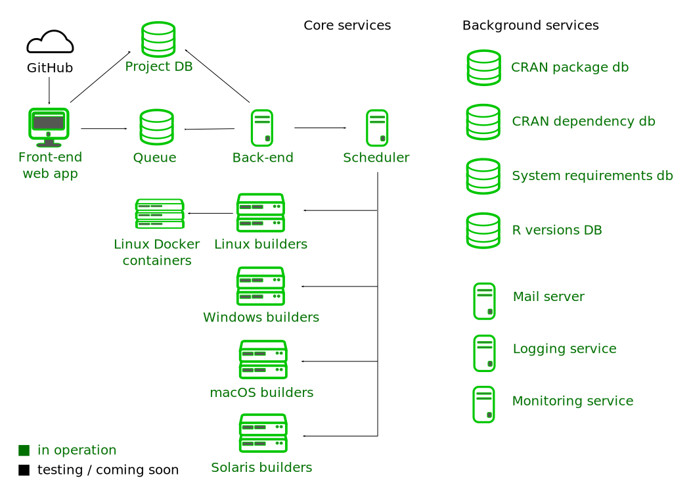

---
title: "R-hub"
author: "Gábor Csárdi"
email: "csardi.gabor@gmail.com"
output:
  rmdshower::shower_presentation:
    self_contained: false
    theme: ribbon
    keep_md: true
    css: style.css
    ratio: 16x10
---	

## { .nonum }

<style type="text/css">
@import url("https://maxcdn.bootstrapcdn.com/font-awesome/4.6.3/css/font-awesome.min.css");
@import url("https://cdn.rawgit.com/gaborcsardi/r-font/master/rlogo.css");
</style>

<h2 style="font-size:400%; margin-top:-80px;">R-hub</h2>

<h2 style="padding-top:26.5%;">Gábor Csárdi</h2>

<p style="line-height: 1">
csardi.gabor@<span></span>gmail.com
</p>


## Outline { .nonum }

```{r setup, echo = FALSE}
options(width = 55)
```

* The R Consortium
* R-hub Architecture
* Demo, website
* Demo, rhub R package
* Local debugging with Docker
* Package and system dependencies
* Checks for compiled code


## The R Consortium

> The central mission of the R Consortium is to work with and provide support
> to the R Foundation and to the key organizations developing, maintaining,
> distributing and using R software through the identification, development
> and implementation of infrastructure projects.

https://www.r-consortium.org

## The R Consortium

Members:

· R Foundation 
· IBM
· Microsoft
· Gordon and Betty Moore Foundation
· RStudio
· Tibco
· Alteryx
· DataCamp
· esri
· Google
· Mango Solutions
· Oracle
· ProCogia

https://www.r-consortium.org/members

## R-hub

### Collection of services to help R package development.

### Goals:

* Ease all steps the R package development process,
  creating a package, building binaries and continuous integration,
  publishing, distributing and maintaining it.
* Make these services free for all members of the community.
* Allow community contributions to R-hub itself.
* Cross platform package building and checking service.

## Package building and checking service

<span class="fa fa-check fa-fw" aria-hidden="true"></span>&nbsp;&nbsp;
Web submission, email notification, https://builder.r-hub.io

<span class="fa fa-check fa-fw" aria-hidden="true"></span>&nbsp;&nbsp;
API, R package client, https://github.com/r-hub/rhub

<span class="fa fa-check fa-fw" aria-hidden="true"></span>&nbsp;&nbsp;
Multi-platform: Linux, Windows, macOS, Solaris

<span class="fa fa-check fa-fw" aria-hidden="true"></span>&nbsp;&nbsp;
Flexible dependency support

<span class="fa fa-check fa-fw" aria-hidden="true"></span>&nbsp;&nbsp;
Binary packages

<span class="fa fa-check fa-fw" aria-hidden="true"></span>&nbsp;&nbsp;
Private and secure (usual disclaimer applies)

## { .nonum }

<h2 class="shout">Architecture</h2>

## { .nonum }



## { .nonum }

<h2 class="shout">Demo</h2>

## The rhub R package

```
platforms()
```

```
validate_email()
list_validated_emails()
```

```
check()
check_for_cran()
check_*()
check(email = ...)
```

## The rhub R package

```
cx <- last_check()
cx <- list_my_checks()
cx <- list_my_checks(package = ...)
cx$details()
cx$livelog()
cx$web()
```

## { .nonum }

<h2 class="shout">Local debugging with Docker</h2>

## Local debugging with Docker

Docker image list: https://hub.docker.com/u/rhub/

Get the container:
```
docker pull rhub/fedora-clang-devel
```

Run it:
```
docker run -ti rhub/fedora-clang-devel bash
```

## Local debugging with Docker

Get the R package, dependencies:
```
## In the container:
dnf install git openssl-devel libxml2-devel
git clone https://github.com/rladies/praise.git
cd praise
echo 'options(repos=c(CRAN="https://cloud.r-project.org"))' > ~/.Rprofile
/opt/R-devel/bin/R -e 'install.packages("devtools")'
/opt/R-devel/bin/R -e 'devtools::install_dev_deps()'
## Quit, and docker commit ...
```

Run package check:

```
/opt/R-devel/bin/R -e 'devtools::check()'
```

## { .nonum }

<h2 class="shout">Package dependencies</h2>

## Package dependencies

* CRAN / BioC packages are automatically supported
* GitHub (or other) packages need a `Remotes` field in `DESCRIPTION`

```
Package: revdepcheck
Title: Automated Reverse Dependency Checking
[...]
Imports: 
    assertthat,
    callr,
[...]
    progress,
    yaml
Remotes: 
    r-lib/callr,
    r-lib/progress,
[...]
```

## { .nonum }

<h2 class="shout">System dependencies</h2>

## System dependencies

* `SystemRequirements` field
* sysreqsdb: https://github.com/r-hub/sysreqsdb
* sysreqs API: https://sysreqs.r-hub.io/

## System dependencies, new entries, via a pull request

```
{
  "libjq": {
    "sysreqs": "libjq",
    "platforms": {
      "DEB": "libjq-dev",
      "RPM": "jq-devel",
      "OSX/brew": "jq"
    }
  }
}
```

## System dependencies, install scripts

```
{
  "protobuf3": {
    "sysreqs": [ "protobuf3" ],
    "platforms": {
      "DEB": { "script": "protobuf-installer.sh" },
      "RPM": { "script": "protobuf-installer.sh" },
      "OSX/brew": "protobuf"
    }
  }
}
```

## { .nonum }

<h2 class="shout">Checks for compiled code</h2>

## Checks for compiled code

* valgrind, to detect memory errors: `rhub::check_with_valgrind()`
* address sanitizers: `rhub::check_with_sanitizers()`
* `PROTECT()` errors: `rhub::check(platform = "ubuntu-rchk")`

## Ongoing work

* Better support for local debugging
* CI via GitHub
* Sysreqs support on macOS, Windows
* Package distribution

## Links

* https://builder.r-hub.io
* https://github.com/r-hub/rhub
* https://github.com/r-hub/rhub/issues
* https://www.r-consortium.org


